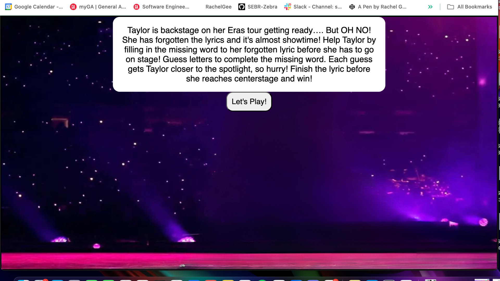
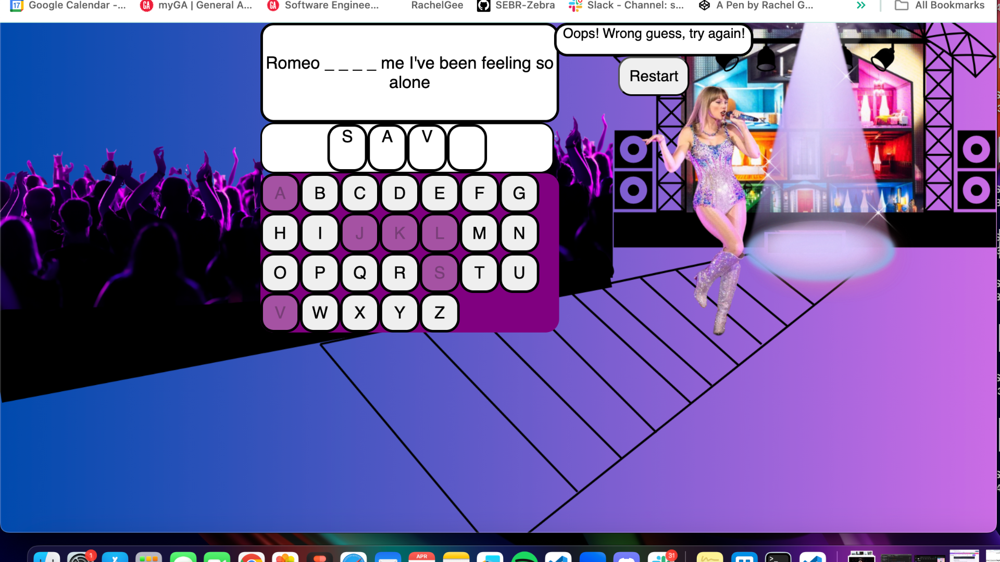
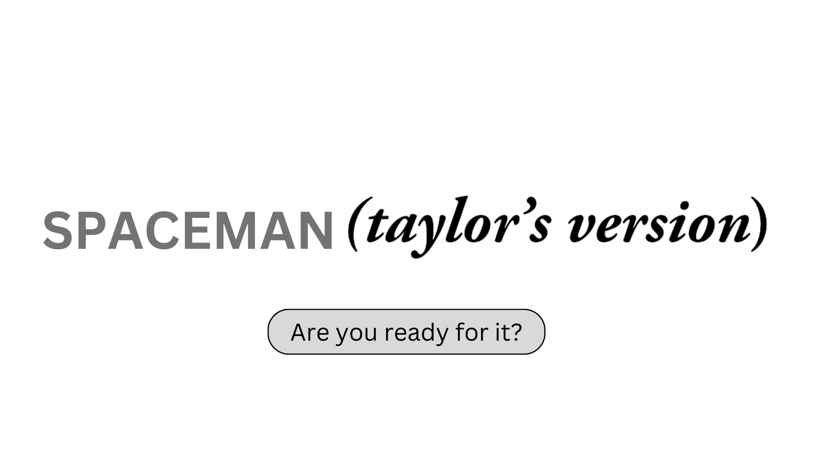
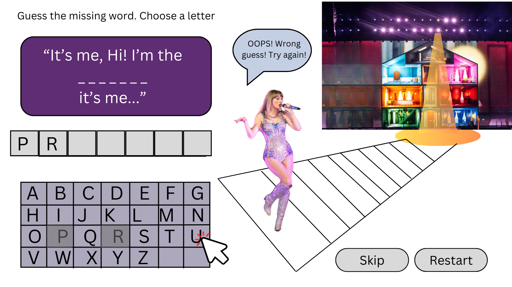

# Spaceman-Taylor-s-Version-Browser-Game

NAME: Spaceman- 🦋 TAYLOR’S VERSION 🦋 

GAME: Taylor is backstage on her Eras tour getting ready…. But OH NO! she’s forgotten the lyrics and it's almost showtime! Help Taylor by filling in the missing word to her forgotten lyric before she has to go on stage!  Guess letters to complete the missing word. Each guess gets Taylor closer to the spotlight. Finish the lyric before she reaches centerstage to save the show and win! 🎤

Click a letter on the keyboard to guess.

-- 📸 SCREENSHOTS 📸 --
INTRO PAGE : 

RULES: 

GAME: 

-- 🌟 LINK TO DEPLOYED GAME 🌟 --
https://rachelgee.github.io/Spaceman-Taylors-Version/ 

-- 🌌 ASSETS 🌌 --
Image assets that I created in Canva for the gameboard background and intro page are included in my "assets' folder in this repository. 

WIRE FRAMES:

💻 TECHNOLOGIES USED: HTML, CSS, JavaScript, Canva (graphic design app)

NEXT STEPS: 
- fix CSS styling
- win/lose modal pop-ups
- 'Skip" button
- Animate Taylor's movement toward stage
- Add Audio
- Add additional lyric options
